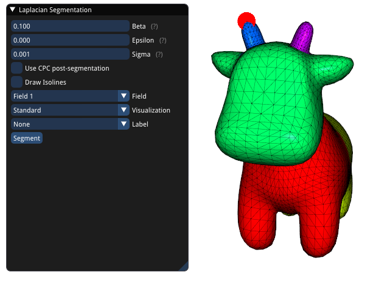
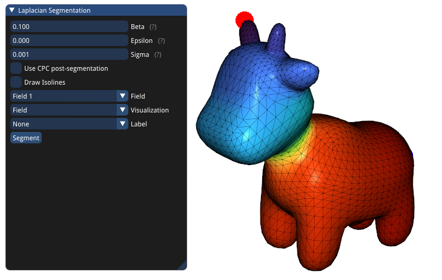

# concavity-aware-fields
## Details
This is my C++ implementation of the 3D mesh segmentation approach from Au et al.

O. Kin-Chung Au, Y. Zheng, M. Chen, P. Xu and C. Tai, "Mesh Segmentation with Concavity-Aware Fields," in IEEE Transactions on Visualization and Computer Graphics, July 2012

A GUI is provided for easier usage.

## Installation/Dependencies:
tested under Ubuntu 20.04
* Boost
* PCL 1.10
* VTK
* glfw3
* OpenGL
* GLUT
* GLEW
* X11
* SPQR
* Ceres
* OpenCV
* Threads
* yaml-cpp
* GTK2 2.6
* CGAL
* libIGL

## References:
* libpcl: major parts of src/include/cpc.cpp are taken from libpcl
* libIGL: major parts of src/include/custom_isolines.cpp and src/include/custom_isolines.cpp are taken from libpcl
* emd: the files src/include/emd.c and src/include/emd.h are from emd
* Pstream: src/include/pstream.h is taken from Pstream
* tinyxml2: src/include/tinyxml2.cpp is taken from tinyxml

